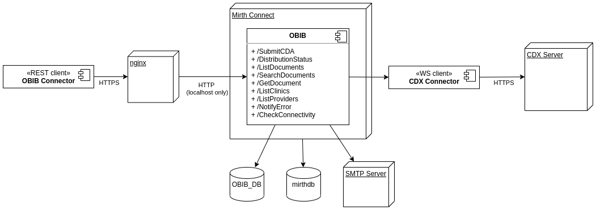
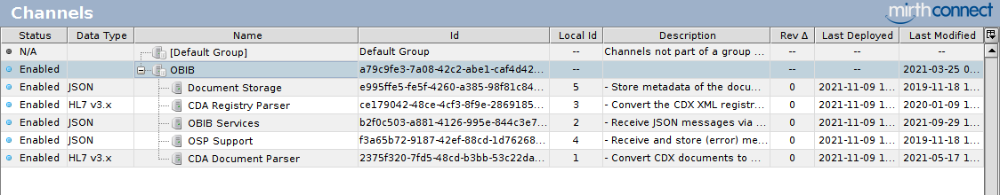
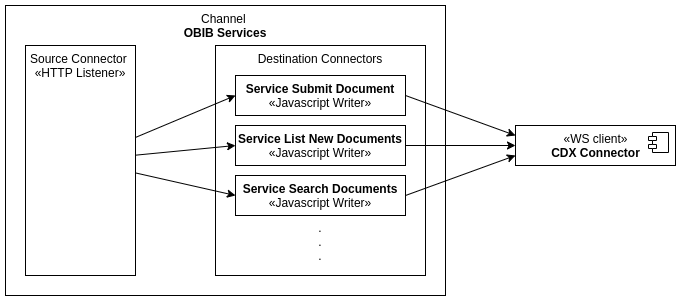

# OBIB Architecture Overview

## OBIB channels

OBIB consists of 5 Mirth Connect channels. 
Each channel has one Source Connector and multiple Destination Connectors.

### OBIB Services channel

**OBIB Services channel** is the main component of OBIB.

#### Source Connector

The Source Connector is an _HTTP Listener_ that performs the following tasks:
- listen to HTTP connections on a port in local interface (e.g. 127.0.0.1:8081);
- perform HTTP authentication (_Javascript_ that verifies the clinicId and password sent in the connection header);
- route messages to the appropriate Destination Connector;

The message routing is performed by Source Transformers which are elements of the Source Connector. The Source Transformers
use the URL context path to route the message to a Destination Connector. For example, a connection with URL
http://127.0.0.1:8081/SubmitCDA is routed to the Destination Connector **Service Submit Document**.

In addition, the Source Connector has two extra Source Transformers that are responsible for retrieving the clinic credentials
from the OBIB_DB database and verify the OBIB Connector version.

#### Destination Connectors

The Destination Connectors are _Javascript Writers_ responsible for the bi-directional transformation and submission of
the messages. They receive messages in the OBIB format (JSON) and submit messages in the CDX format (XML). Then transform
the CDX response from XML to JSON, and return it to the client.

Moreover, the Destination Connectors uses the **CDX Connector** to submit the messages, and each Destination Connector
is responsible for one CDX WS method. For example, **Service Submit Document** submits CDA documents, **Service List New
documents** lists new CDA documents, and so on. The only exception is the **Service OSP Support**, which redirects error
messages sent by the OBIB clients to the **OSP Support** channel.

##### Service Submit Documents

The **Service Submit Documents** connector is responsible for the CDA document submission. It uses a list of transformers
to convert the messages from the JSON to the CDA XML document. Each transformer is implemented to work with a specific
part of the document. For example, **Header Attributes** deals with the CDA headers (loinc_code, template_id, document_id,
document_version, and effective_time). Moreover, the last transformer in the list, **Document Validation**, checks the
document against the XML Schema to ensure the XML is correct.

With the CDA document ready and valid, **Service Submit Documents** stores the document in the database using the
**Document Storage** channel and submits the document using the **CDX Connector**. Then, the CDX response is stored
in the database, and finally, it is processed by the **Submit Document Response** Transformer. This Response Transformer
converts the CDX acknowledgement XML message to an OBIB JSON message. 

##### Service List New Documents

##### Service Search Document

##### Service Get Document

##### Service List Clinics

##### Service List Providers

##### Service Distribution Status

##### Service OSP Support

### CDA Document Parser channel

The **CDA Document Parser**'s Source Connector is a default _Channel Reader_ with no filter or transformer.

**CDA Document Parser** has one Destination Connector that is responsible for parsing CDA XML documents into JSON. 
This connector has a list of transformers to perform the transformation.

### CDA Registry Parser channel

The **CDA Registry Parser**'s Source Connector is a _Channel Reader_ that route the messages to the Destination Channels
according to the type of the messages' assigned entity code, namely Clinic or Provider.

**CDA Registry Parser** has two Destination Connectors responsible for parsing CDA XML messages into JSON. A connector
to parse Clinic Registries and a connector tor parse Provider Registry. Each connector has a list of transformers to
perform the message transformation.

### Document Storage channel

The **Document Storage**'s Source Connector is a _Channel Reader_ that routes the messages to the Destination Channels 
according to the message type.

**Document Storage** has three Destination Connectors of the type _Database Writer_. Each of them store a type of message, 
namely Document, Response and Attachment.

### OSP Support channel

The **OSP Support**'s Source Connector is a default _Channel Reader_ with no filter or transformer.

**OSP Support** has two Destination Connectors. A _Database Writer_ for store the error messages in the database, and 
a _SMTP Sender_ for sending notifications via email.
